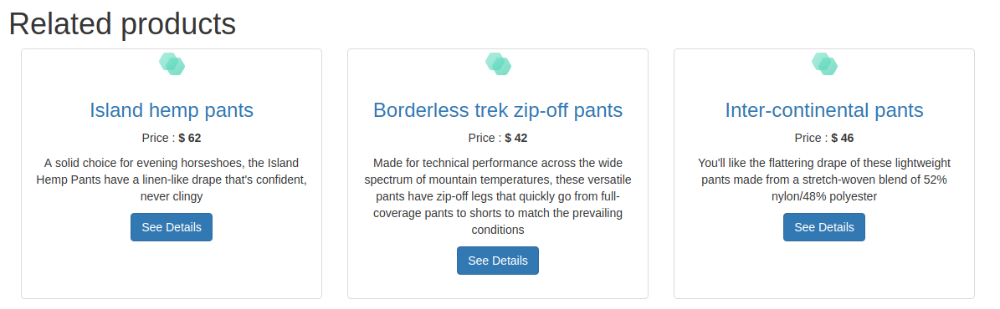

# Recombee API Client

A javascript library for easy use of the [Recombee](https://www.recombee.com/) recommendation API.

It is intended for usage in browsers and other client side integrations (such as in React Native / NativeScript mobile apps). For Node.js SDK please see [this repository](https://github.com/recombee/node-api-client).

Documentation of the API can be found at [docs.recombee.com](https://docs.recombee.com/).

## Installation

The library is [UMD](https://github.com/umdjs/umd) compatible.

### &lt;script&gt; tag

You can download [recombee-api-client.min.js](./dist/recombee-api-client.min.js) and host it at your site, or use a CDN such as [jsDelivr](https://www.jsdelivr.com/) CDN:

```js
<script src="https://cdn.jsdelivr.net/gh/recombee/js-api-client@4.0.0/dist/recombee-api-client.min.js"></script>
```

### npm
Use `npm` also for React Native / NativeScript applications.
```
npm install recombee-js-api-client --save
```

### Bower

```
bower install recombee-js-api-client -S

```

## How to use

This library allows you to request recommendations and send interactions between users and items (views, bookmarks, purchases ...) to Recombee. It uses the **public token** for authentication.

It is intentionally not possible to change item catalog (properties of items) with public token, so you should use one of the following ways to send it to Recombee:

 - Use one of the server-side SDKs (Node.js, PHP, Java...). The synchronization can done for example by a peridodically ran script. See [this section](https://docs.recombee.com/gettingstarted.html#managing-item-catalog) for more details.
 - Set a product feed at [Recombee web admin](https://admin.recombee.com/).

### Sending interactions

```javascript
// Initialize client with name of your database and PUBLIC token
var client = new recombee.ApiClient('name-of-your-db', '...db-public-token...', {region: 'us-west'});

//Interactions take Id of user and Id of item
client.send(new recombee.AddBookmark('user-13434', 'item-256'));
client.send(new recombee.AddCartAddition('user-4395', 'item-129'));
client.send(new recombee.AddDetailView('user-9318', 'item-108'));
client.send(new recombee.AddPurchase('user-7499', 'item-750'));
client.send(new recombee.AddRating('user-3967', 'item-365', 0.5));
client.send(new recombee.SetViewPortion('user-4289', 'item-487', 0.3));
client.send(new recombee.SetUserValues('user-2310', {'country': 'AO', 'sex': 'M'}));

```

### Requesting recommendations

You can [recommend items to user](https://docs.recombee.com/api.html#recommend-items-to-user) or [recommend items to item](https://docs.recombee.com/api.html#recommend-items-to-item).

It is possible to use callbacks or Promises.

#### Callback
Callback function take two parameters:

- *err* - `null` if request succeeds or `Error` object
- *res* - object containg reply from Recombee

```javascript

var callback  = function (err, res) {
  if(err) {
    console.log(err);
    // use fallback ...
    return;
  }
  console.log(res.recomms);
}

// Get 5 recommendations for user-13434
client.send(new recombee.RecommendItemsToUser('user-13434', 5), callback);
```

#### Promise

```javascript
// Get 5 recommendations related to 'item-365' viewed by 'user-13434'
client.send(new recombee.RecommendItemsToItem('item-356', 'user-13434', 5))
.then(function(res) {
  console.log(res.recomms);
})
.catch(function(error) {
  console.log(error);
  // use fallback ...
});
```

### Personalized search

[Personalized full-text search](https://docs.recombee.com/api.html#search-items) is requested in the same way as recommendations.

#### Callback

```javascript
var searchQuery = ' ... search query from search field ....';
client.send(new recombee.SearchItems('user-13434', searchQuery, 5), callback);
```

#### Promise

```javascript
var searchQuery = ' ... search query from search field ....';
client.send(new recombee.SearchItems('user-13434', searchQuery, 5))
.then(function(res) {
  console.log(res.recomms);
})
.catch(function(error) {
  console.log(error);
  // use fallback ...
});
```

### Recommend Next Items

Recombee can return items that shall be shown to a user as next recommendations when the user e.g. scrolls the page down (infinite scroll) or goes to a next page. See [Recommend next items](https://docs.recombee.com/api.html#recommend-next-items) for more info.


```javascript
client.send(new recombee.RecommendItemsToUser('user-13434', 5))
.then(function(res) {
  console.log(res.recomms);

  // Get next 3 recommended items as user-13434 is scrolling the page down
  client.send(new recombee.RecommendNextItems(res.recommId, 3))
  .then(function(res) {
    console.log(res.recomms);
  })
});
```

### Optional parameters
Recommendation requests accept various optional parameters (see [the docs](https://docs.recombee.com/api.html#recommendations)). Following example shows some of them:

```javascript
client.send(new recombee.RecommendItemsToUser('user-13434', 5,
  {
    scenario: 'homepage', // Label particular usage. You can assign various settings
                          // for each scenario in the Admin UI (https://admin.recombee.com/).
    returnProperties: true, // Return properties of the recommended items
    includedProperties: ['title', 'img_url', 'url', 'price'], // Use these properties to show
                                                              // the recommended items to user
    filter: "'title' != null AND 'availability' == \"in stock\""
                                                     // Recommend only items with filled title 
                                                     // which are in stock
  }
), callback);


```

## Integration Example

### 1. Create instant account at recombee.com


### 2. Upload items catalog
You can use a [script](https://docs.recombee.com/gettingstarted.html#managing-item-catalog) or set a product feed at [Recombee web admin](https://admin.recombee.com/). We will set following sample Google Merchant product feed: [product_feed_sample.xml](./examples/product_feed_sample.xml).
You will see the items in web interface after the feed is processed.

### 3. Use client to send interaction and get recommendations

Let's assume we want to show recommendations at product page of pants `product-270` to user with id `user-1539`. The following HTML+js sample send the detail view of the product by the user and request 3 related items from Recombee:
```html
<!DOCTYPE html>
<html lang="en">
<head>
    <link rel="stylesheet" href="https://maxcdn.bootstrapcdn.com/bootstrap/3.3.7/css/bootstrap.min.css">
</head>
<body>
    <div class="container">
        <div class="row">
            <h1>Related products</h1>
            <div class="col-md-12">
                <div class="row" id='relatedProducts'>
                </div>
            </div>
        </div>
    </div>

    <script src="https://cdn.jsdelivr.net/gh/recombee/js-api-client@4.0.0/dist/recombee-api-client.min.js"></script>

    <script type="text/javascript">

    // A simple function for rendering a box with recommended product
    function showProduct(title, description, link, imageLink, price){
        return  [
          '<div class="col-md-4 text-center col-sm-6 col-xs-6">',
          '    <div class="thumbnail product-box" style="min-height:300px">',
          '        ',
          '        <div class="caption">',
          '            <h3><a href="' + link +'">' + title + '</a></h3>',
          '            <p>Price : <strong>$ ' + price + '</strong>  </p>',
          '            <p>' + description+ '</p>',
          '            <a href="' + link +'" class="btn btn-primary" role="button">See Details</a></p>',
          '        </div>',
          '    </div>',
          '</div>'
        ].join("\n")
    }

    // Initialize client
    var client = new recombee.ApiClient('js-client-example', 'dXx2Jw4VkkYQP1XU4JwBAqGezs8BNzwhogGIRjDHJi39Yj3i0tWyIZ0IhKKw5Ln7', {region: 'eu-west'});

    var itemId = 'product-270';
    var userId = 'user-1539'

    // Send detail view
    client.send(new recombee.AddDetailView(userId, itemId));

    // Request recommended items
    client.send(new recombee.RecommendItemsToItem(itemId, userId, 3,
      {
        returnProperties: true,
        includedProperties: ['title', 'description', 'link', 'image_link', 'price'],
        filter: "'title' != null AND 'availability' == \"in stock\"",
        scenario: 'related_items'
      }),
      (err, resp) => {
        if(err) {
          console.log("Could not load recomms: ", err);
          return;
        }
        // Show recommendations
        var recomms_html = resp.recomms.map(r => r.values).
                    map(vals => showProduct(vals['title'], vals['description'],
                        vals['link'], vals['image_link'], vals['price']));
        document.getElementById("relatedProducts").innerHTML = recomms_html.join("\n");
      }
    );
    </script>

</body>
</html>
```
You should see something like this:

<a href="./examples/related_products.png"></a>


Please notice how the properties returned by `returnProperties`&`includedProperties` were used to show  titles, images, descriptions and URLs.

### Remark on user identification

In order to achieve personalization, you need a unique identifier for each user. An easy way can be using Google Analytics for this purpose. The example then becomes:
```javascript
ga('create', 'UA-XXXXX-Y', 'auto'); // Create a tracker if you don't have one
                                    // Replace the UA-XXXXX-Y with your UA code from Google Analytics.

var client = new recombee.ApiClient('js-client-example', 'dXx2Jw4VkkYQP1XU4JwBAqGezs8BNzwhogGIRjDHJi39Yj3i0tWyIZ0IhKKw5Ln7');

ga(function(tracker) {
  var userId = tracker.get('clientId'); // Get id from GA

  client.send(new recombee.RecommendItemsToUser(userId, 3,
    {
      returnProperties: true,
      includedProperties: ['title', 'description', 'link', 'image_link', 'price'],
      filter: "'title' != null AND 'availability' == \"in stock\"",
      scenario: 'homepage'
    }),
    (err, resp) => { ... }
  );
});

```

This time [RecommendItemsToUser](https://docs.recombee.com/api.html#recommend-items-to-user) is used - it can be used for example at your homepage.
